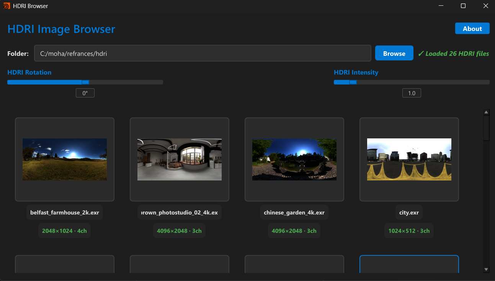
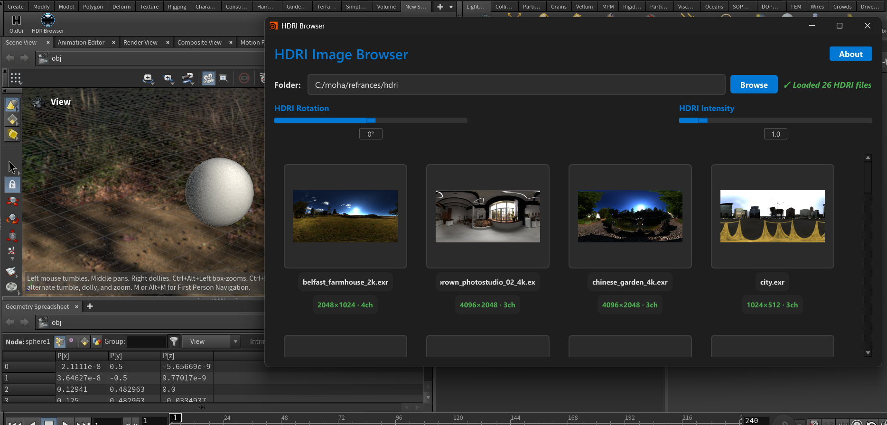

# EXR Browser for Houdini

A modern, fast, and artist-friendly **EXR / HDRI browser** built with **Python + PySide6**,  
designed specifically for **SideFX Houdini** users.

This tool allows you to browse EXR images, preview them as thumbnails, and apply them
instantly as **Environment Lights** inside Houdini with a single click.

---

## ✨ Features

- Modern dark UI optimized for long work sessions  
- Folder path bar with last-folder memory  
- Scrollable grid layout for EXR thumbnails  
- Parallel thumbnail loading using `QThreadPool`  
- Click any thumbnail to apply it as a Houdini **Environment Light**  
- Resolution & channel info displayed per EXR  
- Subtle card fade-in animation  
- Optional time-test decorator for performance debugging  
- Config flags to enable / disable features easily  
- Auto install for lib needed
- offline version no internet needed

> Hover zoom preview is planned but **not fully implemented yet**.

---

## 🖼️ Screenshots


- 
- 

---

## 🎥 Demo 

<a href="https://youtu.be/acKTALoZxMI">
  
</a>

---

## 🛠️ Dependencies

- Python 3.x  
- PySide6  
- OpenImageIO  
- NumPy  
- Houdini (optional – required for Environment Light integration)

Install dependencies:

pip install PySide6 numpy OpenImageIO

---
## 🚀 Usage / Install 


<a href="https://www.youtube.com/watch?v=Lu9vJuhpFS4">
  
</a>


### Option 1: Run Inside Houdini (Direct)

1. Open **Houdini**
2. Open **Python Shell**
3. Paste and run the EXR Browser script
4. Thumbnails load automatically (multi-threaded)
5. Click any thumbnail to apply it as an **Environment Light** in Houdini

If no Environment Light exists, the tool will create one automatically.

---

### Option 2: Install as Houdini Shelf Tool (Recommended)

You can add the EXR Browser as a **Shelf Tool** inside Houdini for quick access.

1. Open **Houdini**
2. Go to **Shelves → New Tool**
3. Set a name, label, and icon (optional)
4. In the **Script** section:
   - Set the language to **Python**
   - Paste the full EXR Browser script code
5. Click **Apply** or **Accept**

You can now launch the EXR Browser directly from the Houdini shelf with one click.

> Tip:  
> For easier updates, you can place the script in a shared tools folder and  
> import it inside the shelf tool instead of pasting the full code.

---

### Option 3: Run Without Houdini (Standalone)

You can also use the EXR Browser as a **standalone desktop application**
without Houdini installed.

1. Make sure Python and all dependencies are installed:
   - PySide6
   - OpenImageIO
   - NumPy
2. Set the following flag at the top of the script:
   
   ```python
   ENABLE_HOUDINI = 0

---

## ⚙️ Configuration Flags

ENABLE_HOUDINI = 1  
ENABLE_ENV_LIGHT_CLICK = 1  
ENABLE_TOOLTIPS = 1  
ENABLE_TIME_TEST = 0  
ENABLE_MULTITHREADING = True  

---

## 🧠 Ideas (Todo)

- HDRI rotation slider  
- Intensity slider  
- Fetch HDRIs from Open Images API  
- Shared HDRI libraries  
- Auto-download HDRI collections  
- Smart filters (indoor / outdoor / studio)  
- Karma HDRI preview  
- Premade lighting setups  
- Multiple HDRI render tests  
- Random HDRI rotation and batch renders  

---

## 👤 Author

MohamedEmadHamida  
3D Artist • Programmer
---

## 📄 License

This project is provided **as-is** for learning and production use.  
You are free to modify and extend it for personal or studio workflows.
