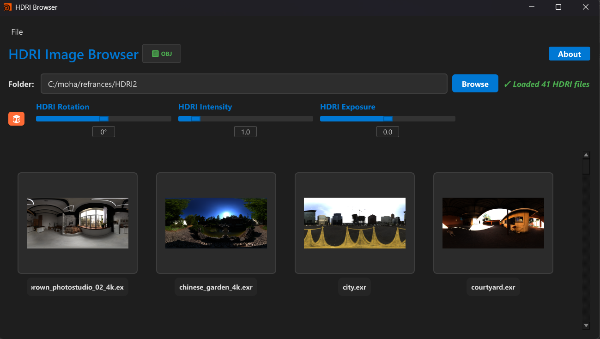
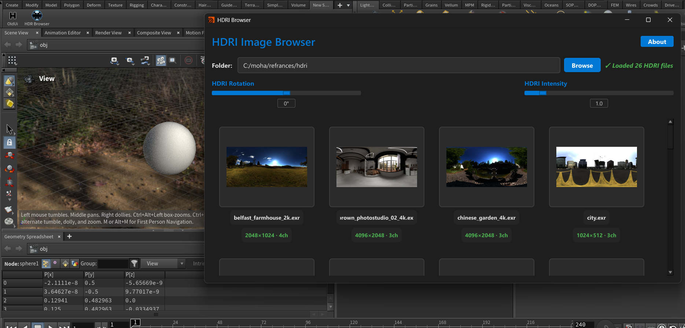
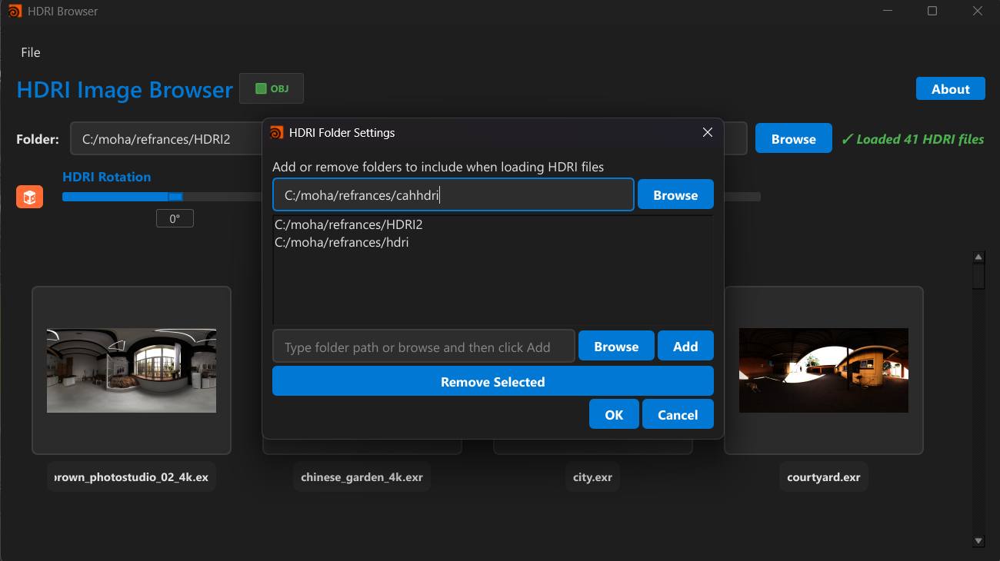
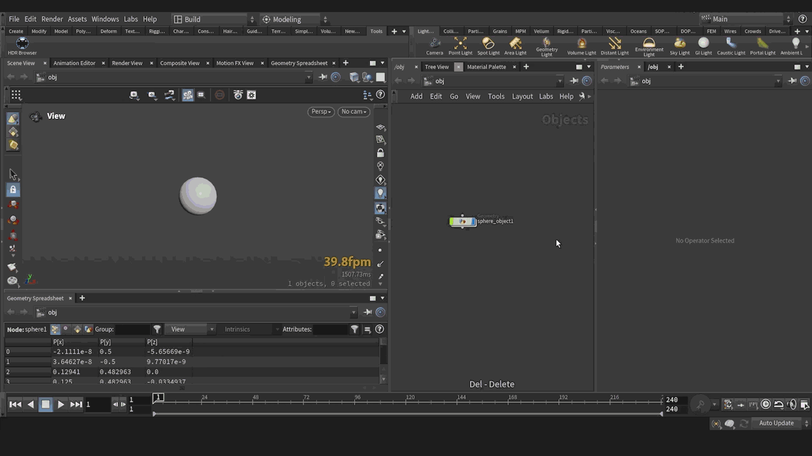

# EXR Browser for Houdini V2

A modern, fast, and artist-friendly **EXR / HDRI browser** built with **Python + PySide6**,  
designed specifically for **SideFX Houdini** users.

This tool allows you to browse EXR images, preview them as thumbnails, and apply them
instantly as **Environment Lights** inside Houdini with a single click.

---

## ✨ Features

- Modern dark UI optimized for long work sessions  
- Folder path bar with last-folder memory  
- Scrollable grid layout for EXR thumbnails  
- Parallel thumbnail loading using `QThreadPool`  
- Click any thumbnail to apply it as a Houdini **Environment Light**  
- Resolution & channel info displayed per EXR  
- Subtle card fade-in animation  
- Optional time-test decorator for performance debugging  
- Config flags to enable / disable features easily  
- Auto install for required libraries
- no internet needed
- Rotation and intensity sliders for HDRI adjustment in Houdini
- Multi-folder HDRI paths
- Cache path for HDRI files
- Solaris (Stage) HDRI support
- Random HDRI Selection 


> Hover zoom preview is planned but **not fully implemented yet**.

---

## 🖼️ Screenshots


- 
- 
- 


---
## 🎥 Demo 


- 

---

## 🛠️ Dependencies

- Python 3.x  
- PySide6  
- OpenImageIO  
- NumPy  
- Houdini (optional – required for Environment Light integration)

Install dependencies:

pip install PySide6 numpy OpenImageIO

---
## 🚀 Usage / Install 


[Click here to view the installation video](https://youtu.be/Lu9vJuhpFS4)


### Option 1: Install as Houdini Shelf Tool Copy Code Simple method

1. Open **Houdini**
2. Go to **Shelves → New Tool**
3. Set a name, label, and icon (optional)
4. In the **Script** section:
   - Set the language to **Python**
   - Paste the full EXR Browser script code (Houdini_HDRI_UI.py)
5. Click **Apply** or **Accept**


If no Environment Light exists, the tool will create one automatically.

---

### Option 2: Install as Houdini Shelf Tool (Recommended)

You can add the EXR Browser as a **Shelf Tool** inside Houdini for quick access.

1. Open **Houdini**
2. Go to **Shelves → New Tool**
3. Set a name, label, and icon (optional)
4. In the **Script** section:
   - Paste 
   - Set the language to **Python**
   - Paste the full EXR Browser script code
5. Click **Apply** or **Accept**

You can now launch the EXR Browser directly from the Houdini shelf with one click.
---

### Option 3: Run Without Houdini (Standalone)

You can also use the EXR Browser as a **standalone desktop application**
without Houdini installed.

1. Make sure Python and all dependencies are installed:
   - PySide6
   - OpenImageIO
   - NumPy
2. Set the following flag at the top of the script:
   
   ```python
   ENABLE_HOUDINI = 0

---

## ⚙️ Configuration Flags

ENABLE_HOUDINI = 1  
ENABLE_ENV_LIGHT_CLICK = 1  
ENABLE_TOOLTIPS = 1  
ENABLE_TIME_TEST = 0  
ENABLE_MULTITHREADING = True  

---

## 🧠 Ideas (Todo)


- Intensity slider  
- Fetch HDRIs from Open Images API  
- Shared HDRI libraries  
- Auto-download HDRI collections  
- Smart filters (indoor / outdoor / studio)    
- Premade lighting setups  
- Multiple HDRI render tests  

---

## 👤 Author

MohamedEmadHamida  
Mohamed Qatary
---

## 📄 License

HDRI Image Browser
Version 2

© 2026 Mohamed Emad ElDin Mostafa 

This software is licensed under the MIT License.
You are free to use, modify, and distribute this tool,
provided that the original copyright notice is included.

THE SOFTWARE IS PROVIDED "AS IS", WITHOUT WARRANTY OF ANY KIND.
